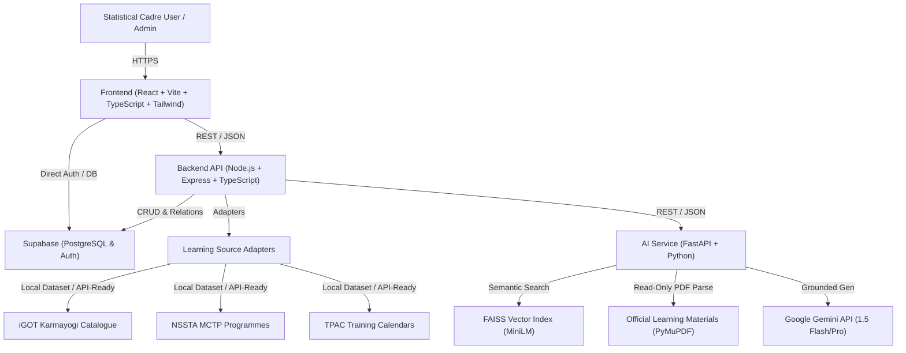

# StatIntel System Architecture Specification

## 1. High-Level Architecture

StatIntel is designed as a modular, three-tier enterprise intelligence platform purpose-built for India's Official Statistical System (MoSPI / NSSTA / iGOT Karmayogi).

---

## 2. Core Subsystems

### 2.1 Frontend (`frontend/`)
- **Technology**: React 18, Vite, TypeScript, Tailwind CSS, Recharts, Lucide React.
- **Role**: Government/Enterprise UX providing transparent gap visualization, role-aligned learning catalog, interactive grounded AI assessments, before/after evidence updates, and executive administrative insights.

### 2.2 Backend (`backend/`)
- **Technology**: Node.js, Express, TypeScript.
- **Design Pattern**: Adapter Pattern for learning sources (`LearningSourceAdapter`), transparent scoring service (`CompetencyScoringService`), and explainable recommendation engine (`RecommendationEngineService`).
- **Data Source Integrity**: Read-only consumption of processed catalogues; zero fake government APIs.

### 2.3 AI & Grounded RAG Service (`ai-service/`)
- **Technology**: FastAPI, FastEmbed (ONNX Runtime CPU with `sentence-transformers/all-MiniLM-L6-v2`), FAISS Vector Index, Google Gemini API.
- **Low-Memory Architecture**: Replaces PyTorch runtime with ONNX Runtime CPU, reducing RAM usage to ~100–140 MB and making it natively deployable on Render's 512 MB tier.
- **Pipeline**:
  1. PDF Ingestion with page preservation.
  2. Overlapping semantic chunking.
  3. Fast normalized ONNX embedding generation and cosine-similarity FAISS indexing (363 chunks, dim=384).
  4. Top-K context retrieval with strict source document, page, and chunk citation metadata.
  5. Strict hallucination-guarded MCQ generation via Gemini.

### 2.4 Transparent Evidence & Scoring Model
Instead of claiming one quiz determines real-world mastery, StatIntel records quiz results as **competency evidence** and uses an exponential moving average / weighted Bayesian update model:
$$\text{Estimated Score}_{\text{new}} = \text{round}\Big(\text{Score}_{\text{prev}} \times (1 - w) + \text{Quiz \%} \times w\Big)$$
where $w = 0.35$ (impact weight).
